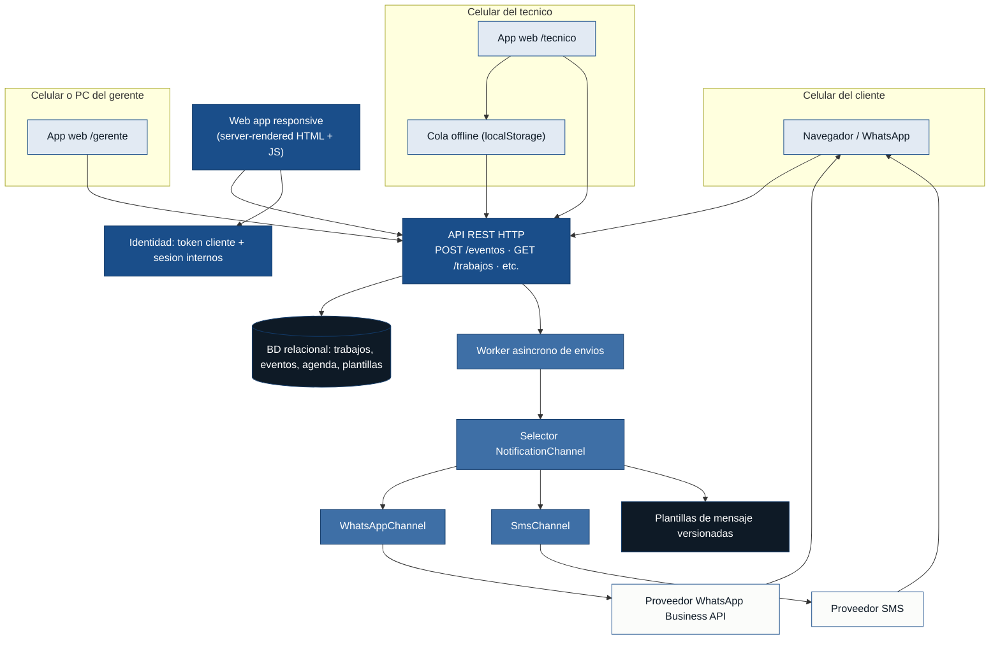

# Arquitectura — tickeSoporte

> Source of truth: `deliveries/tickeSoporte/inbox/` (mvp-canvas, requisitos,
> user-stories, personas, evidence-map) y el backlog refinado en
> `deliveries/tickeSoporte/outputs/` (epics.md, backlog.json, stories.md).
> Cada decisión arquitectónica tiene su ADR en
> `deliveries/tickeSoporte/outputs/adr/`. Cero invención: si una pieza
> no está respaldada por el inbox, está en `open_questions`, no en la
> arquitectura.

## Resumen arquitectónico

Un único sistema HTTP **server-rendered** con una base de datos relacional
y un worker en proceso, expuesto a tres audiencias (técnico, cliente,
gerente) por la **misma web app responsive** con tres rutas diferenciadas.
La notificación al cliente sale del worker por un canal dual
(WhatsApp primario, SMS fallback) y la propagación a las vistas web se
hace por **polling de 30 s**, suficiente para cumplir el "pocos minutos"
de R-12 sin la complejidad de WebSocket/SSE en un MVP de 24 pts. La
identidad del cliente es un **token en URL**; la del técnico y la del
gerente es una **sesión email + password**. La estructura es la mínima
que sostiene el camino crítico "técnico marca un toque → cliente recibe
WhatsApp → cliente ve el estado vía enlace" (US-01 + US-03 + US-04) y
la habilitadora operativa "gerente carga agenda una vez, todos ven el
mismo estado" (US-05 + US-06).

## Diagrama de componentes

### Leyenda de colores

- `#1A4E8A` (azul base) — componentes del backend / núcleo del sistema.
- `#3E6FA6` (outcome / azul medio) — worker y canales de notificación,
  que son los que materializan el outcome del MVP (el cliente recibe el
  aviso).
- `#0E1A26` (casi negro) — datos persistidos.
- `#E2EAF3` (celeste claro) — clientes (frontend) y proveedores
  externos.
- Consistente con `mvp-canvas.md` y `epics.md` (teal/azul), evitando
  los naranjas del output→outcome→impact, que son del impact, no de
  la arquitectura.

## Mapeo componente → historia / épica

| Componente | Historias que soporta | Épica(s) |
|---|---|---|
| **App web `/tecnico`** (vista responsive móvil) | US-01 (botón "voy en camino"), US-02 (botón "se demoró, nueva hora" con 30/60/90 min) | E-01 |
| **Cola offline en `localStorage`** (cliente del técnico) | US-01 nota de refinamiento (latencia ≤ 30 s sin red) | E-01 |
| **API REST `POST /eventos`** | US-01, US-02 (registro de eventos con timestamp del servidor) | E-01 |
| **API REST `GET /trabajos/:id`** (vista cliente) | US-04 (cliente ve estado sin app) | E-02 |
| **API REST `GET /agenda`, `POST /agenda`** (panel gerente) | US-05 (carga de agenda), US-06 (panel compartido) | E-03 |
| **App web `/gerente`** (vista responsive multi-dispositivo) | US-05, US-06 | E-03 |
| **App web `/cliente/<token>`** (vista pública sin login) | US-04 | E-02 |
| **Worker asíncrono de envíos** | US-03 (mensaje automático al cliente) | E-01, E-02 |
| **`WhatsAppChannel`** | US-03, R-09 (canal que el cliente ya usa) | E-01 |
| **`SmsChannel`** (fallback) | US-03, R-09 (cuando no hay WhatsApp) | E-01 |
| **Plantillas versionadas** | US-03 nota de refinamiento (cambio de copy sin redeploy) | E-01 |
| **Identidad: token en URL** | US-04 (cliente sin login), nota de refinamiento | E-02 |
| **Identidad: sesión email + password** | US-06 (gerente y quien ayude), US-01/US-02 (técnico) | E-01, E-03 |
| **BD relacional** (trabajos, eventos, agenda, plantillas, usuarios) | US-01…US-06 (estado durable) | E-01, E-02, E-03 |

## Fuerzas arquitectónicas

Las siguientes restricciones y requisitos no funcionales guían todas las
decisiones de los ADRs:

| Fuerza | Origen | Implicación arquitectónica |
|---|---|---|
| **R-08** · acción de un solo toque | `requisitos.md`, US-01, US-02 | El frontend del técnico debe ser mobile-first, con botones grandes; un solo toque registra el evento. |
| **R-09** · canal que el cliente ya usa, sin app nueva | `requisitos.md`, US-03, US-04, US-06, mvp-canvas "fuera de alcance: app nativa del cliente" | Notificación por WhatsApp o SMS (ADR-0001); vista del cliente y panel del gerente por web responsive (ADR-0002). |
| **R-10** · manos ocupadas, sin tipeo | `requisitos.md`, US-01, US-02 | Cero tipeo en el flujo del técnico; sesión persistente (ADR-0004) para no re-autenticarse en campo. |
| **R-11** · disponibilidad en horario laboral completo | `requisitos.md` | Una sola app web y un solo proceso backend; sin colas externas ni servicios con cuotas que se puedan agotar. |
| **R-12** · propagación en "pocos minutos" | `requisitos.md`, US-02, US-04, US-06 | Worker asíncrono para el envío (US-03) y polling de 30 s para las vistas web (ADR-0003). |
| **Fuera de alcance: app móvil nativa, push propio, multi-técnico simultáneo** | `mvp-canvas.md` | Cierra la opción de app nativa propia; reduce el modelo de identidad al caso 1–2 internos (ADR-0004). |
| **Regla de aislamiento por delivery** | `CLAUDE.md` (regla 5) | Prefijo `tickesoporte-` en recursos; código y datos del MVP viven solo bajo `deliveries/tickeSoporte/` (ADR-0006). |
| **Métrica de éxito: ≥ 70 % de trabajos con aviso automático recibido antes de la llegada** | `mvp-canvas.md` | El camino crítico (US-01 → US-03) es la prioridad arquitectónica. La habilitadora (US-05) es pre-requisito operativo. |

## Decisiones registradas (ADRs)

Los detalles completos están en `deliveries/tickeSoporte/outputs/adr/`.
Resumen de una línea:

- **ADR-0001** · Canal: WhatsApp primario, SMS como fallback.
- **ADR-0002** · Tipo de app: una sola web responsive con tres rutas.
- **ADR-0003** · Propagación: HTTP + BD relacional + polling 30 s (sin WebSocket/SSE en MVP).
- **ADR-0004** · Identidad: token de un solo uso en URL para el cliente; sesión email + password para internos.
- **ADR-0005** · Dirección: texto libre con validación local, sin geocodificación externa.
- **ADR-0006** · Aislamiento por delivery: prefijo `tickesoporte-`, base de datos propia, código contenido.

## Open questions (lo que NO se decide ahora)

Estas piezas son **necesarias** para entregar el MVP, pero el
descubrimiento no las respalda y convertirlas en ADR sería invención.
El equipo las resolverá durante el sprint planning, en la
implementación, o en una segunda iteración del Discovery. No
bloquean el MVP si se resuelven con valores por defecto sensatos.

1. **Proveedor concreto de WhatsApp Business API.** ¿Meta Cloud API
   directa, o un BSP tipo Twilio / 360dialog? Implica costo por
   mensaje, calidad del delivery y complejidad de la integración. La
   decisión de US-03 (ADR-0001) se mantiene: WhatsApp primero; el
   "quién" se elige al implementar.
2. **Proveedor concreto de SMS.** Mismo razonamiento. Es el fallback
   de ADR-0001; basta con un proveedor con cobertura en la zona
   del negocio.
3. **Plantilla inicial de los mensajes.** El PO/gerente definen el
   copy concreto (nombre del negocio, firma, tono). El sistema lo
   trata como dato versionado (nota de refinamiento de US-03), no
   como constante de código. Sin copy, US-03 no se puede probar
   end-to-end, pero el "qué campos" ya está fijado por el criterio
   de aceptación (nombre del técnico, hora estimada, nombre del
   negocio).
4. **Idioma del mensaje de WhatsApp.** Asumido español (mismo que
   las entrevistas y el MVP canvas), pero no explicitado. A
   confirmar con el gerente.
5. **Hosting / cloud provider.** No hay evidencia que lo fije. La
   decisión es operacional, no arquitectónica del producto. El ADR
   sobre esto se escribiría cuando haya un segundo cliente o una
   fecha de despliegue concreta.
6. **Estrategia de "single técnico" vs "gerente + 1 técnico
   secuencial".** El PO lo dejó abierto en `epics.md`. La
   arquitectura del MVP asume un único actor interno autenticado
   por sesión (ADR-0004); si se confirma multi-técnico, US-06 y
   el panel del gerente pueden necesitar una vista "mis trabajos"
   para el técnico. El "fuera de alcance: multi-técnico simultáneo"
   del mvp-canvas cierra el caso concurrente, pero no el caso
   "secuencial". A confirmar en el sprint planning.
7. **Migración a PWA o a WebSocket/SSE.** Mejoras post-MVP
   registradas para evaluarlas **solo si** la métrica de éxito se
   mueve pero la experiencia exige "casi instantáneo" en la vista
   del cliente. No son ADR aceptado en el MVP.
8. **Geocodificación / autocompletado de dirección.** Mejora
   post-MVP, no ADR aceptado (ADR-0005 mantiene texto libre).
9. **Persistencia histórica de la agenda más allá del día actual.**
   US-05 lo declara explícitamente fuera. La decisión de cuánto
   tiempo guardar los eventos/trabajos cerrados se difiere; la
   configuración por defecto debería ser "al menos una temporada
   para poder auditar", pero eso lo confirma el gerente.
10. **Manejo de idempotencia más allá de la ventana de 60 s.** La
    nota de refinamiento de US-03 fija "≤ 60 s" para evitar spam
    por doble toque. La deduplicación más amplia (mismo evento
    significativo en un trabajo ya marcado) es detalle de
    implementación, no de arquitectura.

## Cómo se conecta con la evidencia

- **R-08 / R-10** (un toque, manos ocupadas) → App web `/tecnico` mobile-first
  con botones grandes (ADR-0002).
- **R-09** (canal habitual) → WhatsAppChannel + SmsChannel (ADR-0001).
- **R-11** (disponibilidad) → Un solo proceso backend, sin colas externas
  (ADR-0003).
- **R-12** (latencia pocos minutos) → Worker asíncrono para envío y
  polling 30 s para vistas web (ADR-0003).
- **US-01** → API REST + cola offline + sesión persistente (ADR-0003,
  ADR-0004).
- **US-03** → NotificationChannel selector + WhatsApp primario / SMS
  fallback + plantillas versionadas (ADR-0001).
- **US-04** → Vista pública con token de un solo uso en URL (ADR-0004).
- **US-05** → Formulario de texto libre con validación local
  (ADR-0005).
- **US-06** → Panel `/gerente` con polling 30 s, sesión email+password
  (ADR-0002, ADR-0003, ADR-0004).
- **Regla 5 de la constitución** → ADR-0006.
- **Fuera de alcance del MVP** → justifica descartar app nativa
  propia, push propio, multi-técnico simultáneo, geocodificación,
  PWA, WebSocket/SSE como requisitos del MVP (estos últimos dos
  como open_questions para post-MVP).
