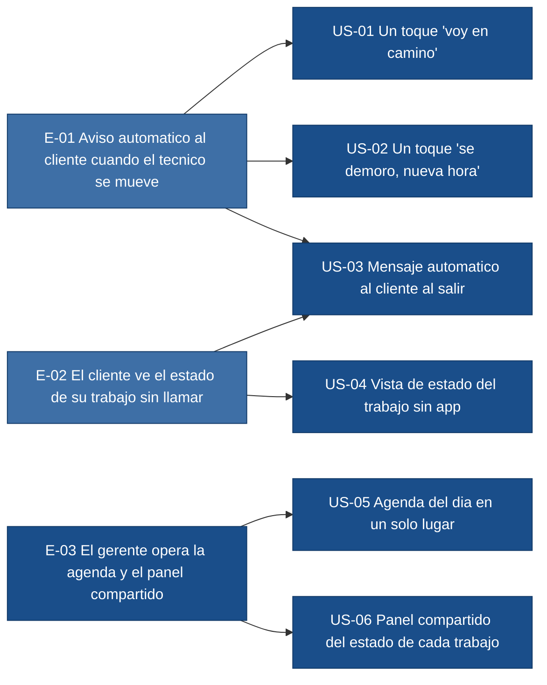

# Epics — tickeSoporte

> Source of truth: `deliveries/tickeSoporte/inbox/` (mvp-canvas, user-stories,
> requisitos, personas, evidence-map). Zero invention. Every epic traces to
> MVP canvas items and/or requisitos. Stories trace to `us:US-NN`, `r:R-NN`
> and/or `pain:<id>` from `evidence-map.json`.

## Diagrama de backlog (epicas -> historias)

Leyenda: base = color base teal/azul (#1A4E8A), outcome = resultado que mueve
la metrica del MVP (#3E6FA6). Los colores son consistentes con
`mvp-canvas.md`.

---

## E-01 · Aviso automatico al cliente cuando el tecnico se mueve

**Valor (outcome):** El cliente del siguiente trabajo recibe un aviso por
WhatsApp con la hora estimada en el momento en que el tecnico termina el
trabajo anterior, sin que el tecnico tenga que llamar ni redactar nada. Esto
mueve la metrica de exito del MVP: *tasa de trabajos del dia en los que el
cliente recibio al menos un aviso automatico de estado antes de la llegada
del tecnico* (umbral >= 70 %).

**Origen:** `mvp-canvas.md` -> Propuesta de valor; Funcionalidades minimas
(2) y (3) (boton un toque y notificacion automatica por WhatsApp).
Requisitos: R-01, R-02, R-03, R-07, R-08, R-10, R-12. Dolores:
`cliente-sin-actualizacion`, `no-poder-atender-telefono`,
`incertidumbre-duracion`, `retraso-sin-aviso`, `espera-sin-informacion`.

**Prioridad:** 1

**Justificacion (una linea):** Es el camino critico que entrega literalmente
la propuesta de valor del MVP (tecnico marca -> cliente recibe); sin este
flujo la metrica de exito no se mueve y el resto del producto no tiene
proposito.

**Historias:** US-01, US-02, US-03

---

## E-02 · El cliente ve el estado de su trabajo sin llamar

**Valor (outcome):** El cliente puede consultar el estado actual de su
trabajo (asignado / en camino / en sitio / finalizado) y la hora estimada
desde un enlace, sin tener que llamar a la empresa; baja las llamadas
"donde viene el tecnico?" y permite al cliente organizar su dia.

**Origen:** `mvp-canvas.md` -> Funcionalidad minima (4) "Vista de estado
del trabajo para el cliente, via enlace, sin app nueva obligatoria".
Requisitos: R-04, R-09. Dolores: `ventana-tiempo-amplia`,
`espera-sin-informacion`, `no-poder-planificar`, `cambio-proveedor-comunicacion`.

**Prioridad:** 2

**Justificacion (una linea):** Aunque el aviso automatico ya cubre el evento
"voy en camino", el dolor "no-poder-planificar" exige una vista persistente;
ademas refuerza el aviso con un canal que el cliente ya usa (sin app nueva,
R-09) y reduce la carga sobre el gerente (R-06).

**Historias:** US-03 (vista de estado), US-04

> Nota: US-03 aparece tambien en E-01 por el angulo "mensaje automatico al
> cliente" y en E-02 por el angulo "vista de estado via enlace". La historia
> cubre ambos comportamientos; en `backlog.json` su `epic` principal es E-01
> (camino critico que dispara la metrica) y la trazabilidad incluye ambos
> origenes.

---

## E-03 · El gerente opera la agenda y el panel compartido

**Valor (outcome):** El gerente (y quien le ayude a contestar mensajes)
carga la agenda del dia una sola vez y ve en una sola vista el estado
actual de cada trabajo, para no depender del papel, del calendario del
telefono ni de que el gerente este disponible para contestar.

**Origen:** `mvp-canvas.md` -> Funcionalidades minimas (1) "Agenda del dia
con orden de trabajos, direccion y hora estimada" y (5) "Panel de estado
compartido". Requisitos: R-05, R-06, R-09. Dolores:
`imposible-coordinar-desde-campo`, `doble-rol-atencion`,
`cliente-cancela-por-demora`, `perdida-clientes`, `reputacion-danada`.

**Prioridad:** 3

**Justificacion (una linea):** Habilitadora operativa: sin agenda cargada
(US-05) el tecnico no tiene "siguiente trabajo" que marcar, y sin panel
compartido (US-06) el gerente sigue siendo cuello de botella de la
atencion. Aunque no mueve la metrica de forma directa, es prerrequisito
para que E-01 y E-02 funcionen en produccion.

**Historias:** US-05, US-06

> US-06 cubre explicitamente el dolor `doble-rol-atencion` del gerente
> general (ver `inbox/user-stories.md`, fila del mapa historia↔requisito↔dolor
> y seccion "Soporte minimo"). En `backlog.json` US-06 pertenece a E-03
> (su epica principal) y su trazabilidad cita `pain:doble-rol-atencion`.

---

## Orden de prioridad y resumen

| Prioridad | Epica | Historias | Pts |
|---|---|---|---|
| 1 | E-01 Aviso automatico al cliente cuando el tecnico se mueve | US-01, US-02, US-03 | 11 |
| 2 | E-02 El cliente ve el estado de su trabajo sin llamar | US-03 (parcial), US-04 | 5 |
| 3 | E-03 El gerente opera la agenda y el panel compartido | US-05, US-06 | 8 |

**Total de historias candidatas en el backlog:** 6 (US-01 a US-06).
**Suma de puntos:** 3 + 3 + 5 + 5 + 5 + 3 = **24 pts**.

US-03 se cuenta una sola vez como historia, aunque su comportamiento aporta
a E-01 y a E-02; en `backlog.json` el campo `epic` principal es E-01
(camino critico) y la trazabilidad incluye ambos origenes.

## Open questions declaradas por el PO

Ninguna bloqueante para el backlog. La siguiente lista son cosas que **no
estan respaldadas por el descubrimiento** y, por la regla de cero
invencion, NO se afirman como hechos ni se convierten en historias. El
equipo debera resolverlas antes o durante el sprint planning, no aqui:

- Si la primera entrega se hara sobre un unico tecnico (el gerente) o si
  tambien participara un tecnico externo con su propio dispositivo. El MVP
  declara "Multi-tecnico simultaneo" fuera de alcance, pero el caso
  "gerente como unico tecnico" frente a "gerente + 1 tecnico secuencial"
  no esta explicitado en `mvp-canvas.md`.
- Identidad del canal de envio para US-03/US-04: el inbox respalda que sea
  "WhatsApp o SMS" (canal que el cliente ya usa, R-09) pero no fija el
  proveedor. Es decision del Architect, no del PO.
- Como se captura la direccion del trabajo en US-05 (texto libre,
  geocodificacion, autocompletado). El requisito R-05 dice "sin escribir
  a mano" pero no precisa el mecanismo; queda al refinamiento del
  Developer.
