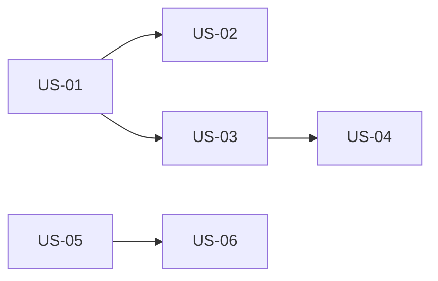

# Historias refinadas — tickeSoporte

> Source of truth: `deliveries/tickeSoporte/inbox/` (mvp-canvas, user-stories,
> requisitos, personas, evidence-map). El set de historias, estimaciones y
> dependencias viene de `backlog.json`; este archivo las refina con
> criterios de aceptación Gherkin y notas de implementación del Developer.
> Toda historia cumple INVEST + Definition of Ready. Gate: `dor-invest-gate.py`.

## Resumen

| ID    | Épica | Pts | Título corto                                | DoR |
|-------|-------|-----|---------------------------------------------|-----|
| US-01 | E-01  | 3   | Un toque 'voy en camino'                    | ✅   |
| US-02 | E-01  | 3   | Un toque 'se demoró, nueva hora'            | ✅   |
| US-03 | E-01  | 5   | Mensaje automático al cliente al salir       | ✅   |
| US-04 | E-02  | 5   | Vista de estado del trabajo sin app          | ✅   |
| US-05 | E-03  | 5   | Agenda del día en un solo lugar             | ✅   |
| US-06 | E-03  | 3   | Panel compartido del estado de cada trabajo | ✅   |
| **Total** |   | **24** |                                          |     |

## Diagrama de dependencias

---

### US-01 · Un toque 'voy en camino'   ·   épica E-01   ·   3 pts
**Como** técnico de campo, **quiero** pulsar un único botón "voy en camino" al terminar el trabajo anterior, **para** que el cliente del siguiente reciba el aviso sin tener yo que llamar ni redactar nada.

Criterios de aceptación (Gherkin):
- Dado que estoy en un trabajo y el siguiente está agendado, cuando pulso "voy en camino", entonces el sistema registra el evento con la hora actual sin pedirme texto adicional.
- Dado que pulso "voy en camino", cuando suelto el botón, entonces la confirmación visual cabe en una sola pantalla sin tecleo adicional (un toque o dos como máximo).
- Dado que estoy con las manos ocupadas, cuando quiero actualizar el estado, entonces no necesito escribir ni desbloquear más de una pantalla.

Notas de refinamiento (Developer):
- La acción debe disparar el evento `tecnico.en_camino` con timestamp del servidor (no del cliente) para que la auditoría y los envíos de US-03 queden alineados con un único reloj.
- Si no hay "siguiente trabajo" agendado en la agenda (US-05 cargada), el botón debe estar deshabilitado con un tooltip claro ("No hay siguiente trabajo agendado"); esto previene pulsos inválidos.
- Latencia objetivo R-12: el evento se persiste en ≤ 30 s aunque la red del cliente sea mala; si no hay conectividad, el cliente del técnico debe encolar la acción localmente y reintentar.

Origen: us:US-01, r:R-01, r:R-08, r:R-10; pains `cliente-sin-actualizacion` y `no-poder-atender-telefono`.

---

### US-02 · Un toque 'se demoró, nueva hora'   ·   épica E-01   ·   3 pts
**Como** técnico de campo, **quiero** poder actualizar la hora estimada del siguiente trabajo con un toque cuando me retrase, **para** avisar al cliente sin tener que llamar yo.

Criterios de aceptación (Gherkin):
- Dado que estoy en un trabajo y me retraso, cuando pulso "se demoró, nueva hora", entonces el sistema permite sumar 30/60/90 minutos a la hora estimada sin tipear.
- Dado que actualizo la hora estimada, cuando confirmo, entonces el cambio queda registrado y se propaga al cliente en pocos minutos.

Notas de refinamiento (Developer):
- El incremento debe ser fijo (30 / 60 / 90 minutos), no libre: el requisito R-03 exige "un toque" y abrir un selector de hora libre reintroduciría tipeo, que es exactamente lo que esta historia elimina.
- Si la nueva hora estimada ya pasó (caso borde: el técnico se retrasó más de lo que había estimado), mostrar un aviso visible pero permitir guardar; el evento se registra igual y US-03 lo propaga como "llegada estimada en el pasado" para que el sistema decida si notificar como inmediato.
- El evento `tecnico.retraso` debe referenciar la hora estimada anterior y la nueva para auditoría y para que el panel del gerente (US-06) pueda mostrar la línea de tiempo.

Origen: us:US-02, r:R-03, r:R-07, r:R-12; pains `incertidumbre-duracion` y `retraso-sin-aviso`.

---

### US-03 · Mensaje automático al cliente al salir   ·   épica E-01   ·   5 pts
**Como** cliente residencial, **quiero** recibir un mensaje automático cuando el técnico salga hacia mi casa, **para** saber que el servicio está en curso y a qué hora estimada llega.

Criterios de aceptación (Gherkin):
- Dado que tengo un trabajo agendado, cuando el técnico pulsa "voy en camino", entonces recibo un mensaje con la hora estimada de llegada por un canal que ya uso (WhatsApp o SMS).
- Dado que recibo el mensaje, cuando lo abro, entonces dice al menos: nombre del técnico, hora estimada de llegada y nombre del negocio.

Notas de refinamiento (Developer):
- La plantilla del mensaje debe ser versionada (un cambio de copy no debe requerir redeploy): el PO o el gerente ajustan el texto sin tocar el código, y el sistema guarda historial de versiones.
- El envío se hace por el canal que el cliente ya usa (WhatsApp o SMS, según R-09). Si el trabajo no tiene teléfono del cliente cargado, la historia falla con error claro dirigido al gerente (panel US-06), no silenciosamente; nada de "se intentó y nada pasó".
- Idempotencia: si el técnico pulsa dos veces "voy en camino" en ≤ 60 s, se envía un único mensaje al cliente. Esto evita spam accidental por doble toque con las manos ocupadas (R-10).

Origen: us:US-03, r:R-02, r:R-04, r:R-09; pains `ventana-tiempo-amplia` y `espera-sin-informacion`.

---

### US-04 · Vista de estado del trabajo sin app   ·   épica E-02   ·   5 pts
**Como** cliente residencial, **quiero** ver el estado actual de mi trabajo (asignado / en camino / en sitio / finalizado) sin tener que llamar a la empresa, **para** poder planificar mi día.

Criterios de aceptación (Gherkin):
- Dado que tengo un trabajo agendado, cuando abro el enlace o la vista de estado, entonces veo el estado actual del técnico y la hora estimada de llegada.
- Dado que el técnico actualiza el estado, cuando refresco, entonces el nuevo estado aparece en pocos minutos sin que yo tenga que llamar.

Notas de refinamiento (Developer):
- La vista de estado es un enlace web sin app (R-09); acceso por token de un solo uso enviado en el mismo mensaje de US-03, sin login ni contraseña. El token caduca al finalizar el trabajo.
- El cliente puede ver el historial de cambios de estado del día (asignado → en camino → en sitio → finalizado), no solo el estado actual; esto refuerza la confianza y reduce la necesidad de llamar.
- Conjunto cerrado de estados: `asignado`, `en_camino`, `en_sitio`, `finalizado`. Cualquier estado fuera de este set es bug y se rechaza en la capa de dominio.

Origen: us:US-04, r:R-04, r:R-09; pains `no-poder-planificar` y `ventana-tiempo-amplia`.

---

### US-05 · Agenda del día en un solo lugar   ·   épica E-03   ·   5 pts
**Como** gerente general, **quiero** registrar la agenda del día (orden de trabajos, dirección y hora estimada inicial) desde un solo lugar, **para** no escribir a mano y para que cualquiera que mire vea lo mismo que yo.

Criterios de aceptación (Gherkin):
- Dado que es el inicio del día, cuando cargo los trabajos del día, entonces quedan en una lista con orden, dirección y hora estimada inicial visible para mí y para quien ayude a contestar.
- Dado que tengo la lista cargada, cuando entro a la herramienta, entonces veo la agenda completa del día en una sola vista.

Notas de refinamiento (Developer):
- La captura de dirección puede ser texto libre, autocompletado, o pegado desde WhatsApp — el requisito R-05 no precisa mecanismo; la decisión de UX/geocodificación queda al Architect.
- La agenda es por día; la persistencia histórica y la consulta de días anteriores NO entran en esta historia. Es superficie mínima viable para que el técnico tenga "siguiente trabajo" que marcar en US-01.
- La edición posterior (cambiar hora estimada inicial, reordenar) es deseable para el gerente pero NO es criterio de esta historia; se registra como follow-up explícito para que no se infle el sprint.

Origen: us:US-05, r:R-05, r:R-06; pain `imposible-coordenar-desde-campo`.

---

### US-06 · Panel compartido del estado de cada trabajo   ·   épica E-03   ·   3 pts
**Como** gerente general, **quiero** que quien me ayuda a contestar mensajes vea el estado de cada trabajo del día, **para** no depender solo de mí para contestar.

Criterios de aceptación (Gherkin):
- Dado que hay trabajos cargados en el día, cuando entro al panel, entonces la lista muestra el estado actual de cada trabajo (asignado, en camino, en sitio, finalizado) y se actualiza cuando el técnico lo cambia.

Notas de refinamiento (Developer):
- El panel debe ser accesible desde el celular del gerente y desde un computador de quien le ayude a contestar mensajes (R-09: canal que ya usa). Por tanto, vista web responsive, no app nativa.
- La actualización del panel debe ser por push o polling en ≤ 60 s para cumplir la latencia de "pocos minutos" de R-12; el equipo decide el mecanismo (WebSocket/SSE/poll) en el sprint planning.
- Permisos: solo el gerente y quien invite pueden ver la agenda completa; un técnico no ve la agenda completa, solo sus trabajos asignados (esto se alinea con el "fuera de alcance: multi-técnico simultáneo" del mvp-canvas).

Origen: us:US-06, r:R-06, r:R-09; pain `doble-rol-atencion`.
